# Dev-Center: Product Specification & Technical Architecture

`dev-center` is a highly scalable, multi-tenant recruitment, AI-screening, and live collaborative interview platform. It solves the fragmentation of hiring tools by consolidating Applicant Tracking (ATS), smart job boards, AI voice/coding assessments, and in-app video/coding rooms into one unified experience.

---

## 1. Product Refinements (Based on User Feedback)

### A. Auto-Discovery via Domain Verification & Approval Queue
* When an employee registers with a corporate email (e.g. `user@tcs.com`), they are not immediately given access to the TCS workspace.
* Instead, they are placed in a **Pending Approval Queue** inside the Organization's Admin console.
* The workspace Super Admin/HR gets a notification to approve or reject the user, ensuring strict enterprise security.

### B. Candidate Portal & AI Job Recommendations ("AI Everywhere")
* Candidates have a dedicated portal where they can browse and search open jobs posted by different organizations.
* **AI Matchmaking Engine**: The system parses the candidate's profile/resume and automatically recommends jobs that match their skills, experience level, and preferred roles.
* Candidates can track application progress (e.g., "Round 2: Technical Interview"), view scheduled slots, and update profiles.

### C. Customized Job Application Forms & Templates
* When creating a job, the recruiter decides how many rounds are required.
* To gather extra screening details, recruiters can select from **Predefined Custom Form Templates** or add custom questions:
  * *Ex-employee status verification*
  * *Visa status & sponsorship requirements*
  * *Country-specific background check authorizations*
  * *Criminal disclosures or general declarations*
* These custom questions are appended to the applicant’s initial application form.

### D. Dual-Arena Coding Test & Compiler Setup
The coding arena supports two distinct evaluation pipelines depending on the language/framework being tested:

1. **Backend / General Purpose Languages (Python, Go, Java, C++, JS scripting, etc.)**:
   * Uses the **Gemini API as a Virtual Compiler**.
   * On submit, candidate code, problem description, and test cases are sent to Gemini.
   * Gemini executes virtual evaluation and returns a structured JSON payload detailing the status of every individual test case (e.g., `TestCase 1: Passed`, `TestCase 2: Failed [expected X, got Y]`), overall logical correctness, complexity, and grading.
2. **Frontend Frameworks & Web UI (React, HTML, CSS, Vanilla JS)**:
   * Uses an in-browser client-side runtime sandboxed runner (such as **Sandpack by CodeSandbox** or standard sandboxed `iframes`).
   * This provides a live, interactive preview panel of the UI candidate is building.
   * Real-time rendering is done client-side. The code is then analyzed by Gemini for structure, clean component breakdown, styling logic, and best practices to provide a grading score.

### E. Candidate Draft Application & Screening Reminders
* **Partial Application Save**: Candidates are not required to complete their application form and AI pre-screening in a single session. They can fill out forms partially, saving their progress.
* **Applicant Lifecycle**:
  * `Draft`: Form filled partially and saved, but not yet submitted.
  * `Applied`: Form submitted; candidate is ready but has not started AI pre-screening.
  * `Screening_In_Progress`: Candidate has started the voice/coding tests but has not finished all required rounds.
  * `Screening_Completed`: Pre-screening is fully done, and results are graded.
  * `Qualified` / `Rejected` / `Hired`: Subsequent recruitment stages.
* **Notification Engine (Reminders)**: Background cron jobs (Resend + Queue scheduler) periodically check for applications stuck in `Draft` or `Applied` (but screening incomplete) and trigger email reminders (e.g. "Complete your pre-screening for TCS Software Engineer role").

### F. Role-Based Access Control (RBAC) Permissions
Employee roles enforce distinct administrative and functional permissions:
* **Admin**:
  * Full access to Organization Settings, Billing & subscriptions (Stripe).
  * Can invite, approve (`Pending_Approval` queue), and remove any employee (Admin, Recruiter, or Interviewer) from the organization.
  * Can create, edit, draft, or delete Jobs and Form Templates.
* **Recruiter (HR)**:
  * Can invite, approve, and remove Recruiters and Interviewers (cannot remove Admins).
  * Can create, edit, draft, or delete Jobs and Form Templates.
* **Interviewer**:
  * Read-only access to Job definitions and Candidate resumes/profiles.
  * Restricted from creating/deleting jobs or managing employees.
  * Allowed to join assigned live interview rooms, write markdown notes, and fill out candidate scorecards.

---


## 2. Project Folder Architecture

To ensure high scalability, micro-level code ownership, and ease of maintenance as the application grows, we will follow a **Feature-Based (Modular) Architecture** combined with Next.js App Router conventions:

```
dev-center/
├── app/                      # Next.js Routes (Pages, Layouts, API Route handlers)
│   ├── (auth)/               # Route Group for Authentication (Login, Register)
│   ├── (dashboard)/          # Route Group for Organization/Employee Dashboards
│   ├── (candidate)/          # Route Group for Candidate Portal
│   ├── api/                  # Global API Route Handlers (Webhooks, LiveKit tokens)
│   ├── layout.tsx            # Global Layout
│   └── page.tsx              # Public Landing / Job Board Page
│
├── features/                 # Domain-Specific Modules (Self-contained logic)
│   ├── auth/                 # Authentication features (NextAuth callbacks, custom middleware)
│   ├── jobs/                 # Job posting, status toggle, custom question templates
│   ├── screening/            # AI Verbal screening & AI Virtual Compiler pipelines
│   ├── interview/            # Live WebRTC Meeting Room, Monaco editor, Interviewer notes
│   ├── billing/              # Stripe Checkouts, Webhooks, Portal sessions
│   └── dashboard/            # Metrics charts, pending approval tables
│       # Inside each feature module:
│       ├── components/       # Feature-specific UI components (e.g. JobCard, VoiceRecorder)
│       ├── hooks/            # Feature-specific custom hooks (e.g. useVoiceTranscription)
│       ├── actions/          # Next.js Server Actions for database mutations
│       ├── types.ts          # Feature-specific TypeScript models
│       └── utils/            # Feature-specific utility helpers
│
├── components/               # Global & Shared UI Components (shadcn/ui elements)
│   ├── ui/                   # Reusable atomic controls (button, dialog, input, card)
│   └── shared/               # Composite shared components (navbar, sidebar, theme-toggle)
│
├── hooks/                    # Global Shared Hooks (useDebounce, useMediaQuery)
│   
├── lib/                      # Third-Party Client initializations & Helpers
│   ├── prisma.ts             # Prisma Database Client
│   ├── gemini.ts             # Gemini API Client
│   ├── livekit.ts            # LiveKit Server Client
│   ├── stripe.ts             # Stripe Helper functions
│   └── utils.ts              # Global utilities (cn class merging helper)
│
├── prisma/                   # Prisma ORM Schema & Database Migrations
│   └── schema.prisma
│
├── public/                   # Static Assets (Images, Icons, Fonts)
├── types/                    # Global TypeScript definitions
└── package.json
```

### Why this architecture?
* **High modulatity**: If we need to modify the Live Meeting room code, everything is in `features/interview/` instead of jumping between random global folders.
* **Separation of Concerns**: Global `components/` only contains generic visual blocks (atoms/molecules like button, select). Business logic is confined strictly inside `features/`.

---

## 3. Core Technology Stack

We will use a modern, developer-friendly, and highly scalable stack:

* **Package Manager**: `pnpm` (highly optimized workspace caching).
* **Frontend Framework**: **Next.js 16 (App Router)** with **React 19** (Server Components, Server Actions for form submissions, and Streaming).
* **Styling & UI**: **Tailwind CSS v4** + **shadcn/ui** components. Managed by **next-themes** (System, Light, Dark). 
  * *Aesthetics Rule*: Keep the UI clean, simple, and minimalist. Stick to standard shadcn presets and light/dark modes. **Do NOT add custom color palettes or extra style modifications**.
* **Database**: **PostgreSQL** (relational structures are perfect for ATS workflows, candidate states, and complex audit logs).
* **ORM**: **Prisma ORM** (type-safe queries, migration handling, and clean relations).
* **Authentication**: **Auth.js (NextAuth v5)** - *Self-Hosted Custom Auth*:
  * **Database Storage**: Uses **Prisma Adapter** to store all authentication schemas (`User`, `Account`, `Session`, `VerificationToken`) directly inside our PostgreSQL database (100% data ownership).
  * **Session Strategy**: **JWT (JSON Web Tokens)** strategy for zero-latency session checks on Next.js page requests (avoids recurring DB queries, highly scalable for millions of users).
  * **Providers**: Credentials provider (Email + Password), Google OAuth, GitHub OAuth, LinkedIn OAuth.
  * **Custom Verification Pipeline**: Uses **Resend** to send transactional OTP/magic link verification codes for onboarding and password-resets.
  * **Tenant Mapping**: Enforces custom JWT session claims to inject `organization_id` and role permissions directly inside token cookies, allowing rapid row-level validation.
* **State & API Layer**:
  * **tRPC**: For end-to-end type-safe API requests.
  * **TanStack Query (React Query)**: For server state management, caching, and background sync on the client.
  * **Zustand**: For lightweight client-side state management (handles active video panels, live code editing state, and interview states).
* **Realtime Communication & Live Video Room**:
  * **LiveKit**: WebRTC media server for video, audio, and screensharing. Highly scalable, handles multi-party rooms.
  * **WebSockets (Socket.io/Pusher)**: For collaborative text editing, instant messages, and real-time candidate assessment logs.
* **AI Engine**: **Gemini API** (`@google/generative-ai`) for parsing resumes, screening verbal questions, virtual code compiler, and job matching.

---

## 4. Subscription & Billing Model (Stripe)

To monetize the platform, we will implement a multi-tiered subscription model using **Stripe Billing**:

| Feature / Limit | Free / Starter | Pro (Growth) | Enterprise |
| :--- | :--- | :--- | :--- |
| **Pricing** | $0 / month | $149 / month | Custom Enterprise |
| **Active Job Posts** | Max 2 active jobs | Max 15 active jobs | Unlimited active jobs |
| **AI Screening Credits** | 10 candidates / month | 250 candidates / month | Custom quota / Unlimited |
| **Domain Auto-Queue** | ❌ (Manual invite only) | ✅ (Domain auto-queue) | ✅ (Auto-queue & SSO) |
| **Custom Templates** | Basic | Advanced templates | Fully custom templates |
| **Integrations** | Manual posting | Auto-post to LinkedIn/Naukri | API access & direct ATS sync |

---

## 5. Multi-Tenant Architecture & Database Schema

To scale to millions of users, `dev-center` uses a **Shared-Database, Single-Schema (Tenant Isolated)** design:

* Every workspace table contains an `organization_id` column (or links to one transitively).
* Database queries are always filtered by `organization_id` of the logged-in employee.
* Strict tenant checks are enforced at the API/Server Action level.

```mermaid
erDiagram
    ORGANIZATION ||--o{ EMPLOYEE : employs
    ORGANIZATION ||--o{ JOB : posts
    ORGANIZATION ||--o{ JOB_BOARD_CONNECTION : connects
    ORGANIZATION ||--o| SUBSCRIPTION : has
    ORGANIZATION ||--o{ QUESTION : owns
    JOB ||--o{ JOB_ROUND : defines
    JOB_ROUND ||--o{ JOB_ROUND_INTERVIEWER : has
    EMPLOYEE ||--o{ JOB_ROUND_INTERVIEWER : conducts
    APPLICANT ||--o{ INTERVIEW : undergoes
    EMPLOYEE ||--o{ INTERVIEW : conducts
    APPLICANT ||--o| SCREENING_RESULT : has
    JOB ||--o{ JOB_BOARD_POST : distributes
    SUBSCRIPTION }|--|| PLAN : references
    SKILL ||--o{ JOB_SKILL : mapped
    JOB ||--o{ JOB_SKILL : requires
    SKILL ||--o{ APPLICANT_SKILL : mapped
    APPLICANT ||--o{ APPLICANT_SKILL : possesses
    USER ||--o{ NOTIFICATION : receives
    ORGANIZATION ||--o{ EMPLOYEE_INVITATION : issues
    
    ORGANIZATION {
        string id PK
        string name
        string domain
    }
    
    EMPLOYEE {
        string id PK
        string organization_id FK
        string user_id FK
        string role "Admin, Recruiter, Interviewer"
        string status "Active, Pending_Approval"
    }

    JOB {
        string id PK
        string organization_id FK
        string title
        string description
        string status "Draft, Active, Completed"
        string employment_type "Full_Time, Part_Time, Contract, Internship"
        string experience_level "Entry, Mid, Senior, Lead, Executive"
        float salary_min
        float salary_max
        string currency
        string location
        string remote_type "Onsite, Hybrid, Remote"
        datetime published_at
        datetime closing_date
    }

    SKILL {
        string id PK
        string name
    }

    JOB_SKILL {
        string id PK
        string job_id FK
        string skill_id FK
    }

    APPLICANT_SKILL {
        string id PK
        string applicant_id FK
        string skill_id FK
    }

    JOB_ROUND {
        string id PK
        string job_id FK
        int order_index
        string title
        string category "Screening, Technical, Design, Behavioral, Management"
        int duration_minutes
    }

    JOB_ROUND_INTERVIEWER {
        string id PK
        string round_id FK
        string employee_id FK
    }

    APPLICANT {
        string id PK
        string job_id FK
        string user_id FK "nullable"
        string current_round_id FK "nullable"
        string name
        string email
        string status "Applied, Screening, Shortlisted, Interviewing, Offer, OfferAccepted, OfferRejected, Hired, Rejected, Withdrawn, OnHold"
        string resume_url
        string phone
        string linkedin_url
        string github_url
        string portfolio_url
        int experience_years
        string current_company
        string current_designation
        float expected_salary
        float current_salary
        int notice_period
        string location
        boolean country_permit
        boolean criminal_record
        boolean is_existing_employee
        string source "e.g. LinkedIn, Indeed"
        jsonb form_responses
        int screening_score
    }

    SCREENING_RESULT {
        string id PK
        string applicant_id FK
        string ai_model "e.g. gemini-2.0-flash"
        int resume_score
        string resume_feedback
        int voice_score
        string voice_feedback
        string voice_transcript
        int coding_score
        string coding_feedback
        jsonb coding_source_tree
        int personality_score
        int overall_score
        string recommendation "Strong_Hire, Hire, No_Hire, Strong_No_Hire"
    }

    INTERVIEW {
        string id PK
        string applicant_id FK
        string job_round_id FK
        string interviewer_id FK
        string status "Scheduled, Completed, Cancelled, Absent"
        datetime start_time
        datetime end_time
        string meeting_link
        string livekit_room_id
        int technical_score
        int communication_score
        int problem_solving_score
        int culture_score
        int overall_score
        string recommendation "Strong_Hire, Hire, No_Hire, Strong_No_Hire"
        string feedback
    }

    JOB_BOARD_CONNECTION {
        string id PK
        string organization_id FK
        string provider "LINKEDIN, INDEED, NAUKRI, MONSTER, GLASSDOOR, WELLFOUND, GREENHOUSE, LEVER"
        jsonb credentials "Encrypted access tokens"
        string status "Connected, Expired, Disconnected"
    }

    JOB_BOARD_POST {
        string id PK
        string job_id FK
        string provider "LINKEDIN, INDEED, NAUKRI, MONSTER, GLASSDOOR, WELLFOUND, GREENHOUSE, LEVER"
        string external_job_id "nullable"
        string url "External redirection link"
        string status "Pending, Posted, Failed"
        string error_message "nullable"
        datetime posted_at
    }

    PLAN {
        string id PK
        string name "Free, Pro, Enterprise"
        int price
        int active_jobs_limit
        int ai_credits_limit
    }

    SUBSCRIPTION {
        string id PK
        string organization_id FK
        string plan_id FK
        string stripe_customer_id
        string stripe_subscription_id
        string stripe_price_id
        datetime stripe_current_period_end
    }

    QUESTION {
        string id PK
        string organization_id FK
        boolean is_system
        string title
        string description
        string category "Coding, System_Design, System_Architecture, Behavioral, Technical_Theory, Business_Case"
        string difficulty "Easy, Medium, Hard"
        array tags
        array languages
        int time_limit
        int memory_limit
        jsonb test_cases
        jsonb starter_code
        string solution_code
    }

    NOTIFICATION {
        string id PK
        string user_id FK
        string title
        string content
        boolean is_read
        string type "System, Application_Update, Interview_Scheduled, Screening_Completed, Employee_Invite"
        string action_url
    }

    EMPLOYEE_INVITATION {
        string id PK
        string email
        string role "Admin, Recruiter, Interviewer"
        string token
        string organization_id FK
        datetime expires_at
    }
```



---

## 6. Scalability Strategy

To handle high traffic loads (millions of users/candidates):

1. **Database Connection Pooling**: Use serverless connection poolers (like **Supabase Connection Pooler** or **Prisma Accelerate**) to prevent crashing under spike loads.
2. **Heavy-Weight Caching**: Use **Redis** to cache:
   * Active job postings on the public board.
   * User session data.
   * Real-time metadata for live interview rooms.
3. **Asynchronous Background Processing**:
   * Use a background worker library (like **BullMQ** with Redis or Serverless Edge functions) for slow operations:
     * Parsing PDFs/resumes using LLMs.
     * Sending email notifications to candidates/interviewers.
     * Pushing jobs to external boards (LinkedIn/Naukri).
4. **AI Cost Optimization**: Implement rate-limiting for candidate tests to prevent API spamming and control costs.
