# Dev-Center: Product Specification & Technical Architecture

`dev-center` is a highly scalable, multi-tenant recruitment, AI-screening, and live collaborative interview platform. It solves the fragmentation of hiring tools by consolidating Applicant Tracking (ATS), smart job boards, AI voice/coding assessments, and in-app video/coding rooms into one unified experience.

---

## 1. Product Refinements (Based on User Feedback)

### A. Progressive Onboarding & Tokenized Employee Invites
* **Progressive 2-Step Registration (`/register`)**: Step 0 (Intent Choice: Candidate vs Register Organization) -> Step 1 (Email Exist Check `checkEmailExists` & Social Auth) -> Step 2 (Credentials).
* **Tokenized Employee Onboarding**: Uninvited public employee registration is eliminated. Team members and employees join strictly via tokenized invitation links generated by Admins (`/register?inviteToken=xyz`).
* **Organization Setup (`/setup-org`)**: Org Founders set up company details, domain, website, LinkedIn, and HQ location on `app/(auth)/setup-org/page.tsx` to activate `OWNER` status and access `/dashboard`.

### B. Candidate Portal & AI Job Recommendations ("AI Everywhere")
* Candidates have a dedicated portal where they can browse and search open jobs posted by different organizations.
* **AI Matchmaking Engine**: The system parses the candidate's profile/resume and automatically recommends jobs that match their skills, experience level, and preferred roles.
* Candidates can track application progress (e.g., "Round 2: Technical Interview"), view scheduled slots, and update profiles.

### C. Customized Job Application Forms & Templates
* When creating a job, the recruiter decides how many rounds are required.
* To gather extra screening details, recruiters can select from **Predefined Custom Form Templates** or add custom questions:
  * *Ex-employee status verification*
  * *Visa status & sponsorship requirements*
  * *Country-specific background check authorizations*
  * *Criminal disclosures or general declarations*
* These custom questions are appended to the applicant’s initial application form.

### D. Dual-Arena Coding Test & Compiler Setup
The coding arena supports two distinct evaluation pipelines depending on the language/framework being tested:

1. **Backend / General Purpose Languages (Python, Go, Java, C++, JS scripting, etc.)**:
   * Uses the **Gemini API as a Virtual Compiler**.
   * On submit, candidate code, problem description, and test cases are sent to Gemini.
   * Gemini executes virtual evaluation and returns a structured JSON payload detailing the status of every individual test case (e.g., `TestCase 1: Passed`, `TestCase 2: Failed [expected X, got Y]`), overall logical correctness, complexity, and grading.
2. **Frontend Frameworks & Web UI (React, HTML, CSS, Vanilla JS)**:
   * Uses an in-browser client-side runtime sandboxed runner (such as **Sandpack by CodeSandbox** or standard sandboxed `iframes`).
   * This provides a live, interactive preview panel of the UI candidate is building.
   * Real-time rendering is done client-side. The code is then analyzed by Gemini for structure, clean component breakdown, styling logic, and best practices to provide a grading score.

### E. Candidate Draft Application & Screening Reminders
* **Partial Application Save**: Candidates are not required to complete their application form and AI pre-screening in a single session. They can fill out forms partially, saving their progress.
* **Applicant Lifecycle**:
  * `Draft`: Form filled partially and saved, but not yet submitted.
  * `Applied`: Form submitted; candidate is ready but has not started AI pre-screening.
  * `Screening_In_Progress`: Candidate has started the voice/coding tests but has not finished all required rounds.
  * `Screening_Completed`: Pre-screening is fully done, and results are graded.
  * `Qualified` / `Rejected` / `Hired`: Subsequent recruitment stages.
* **Notification Engine (Reminders)**: Background cron jobs (Resend + Queue scheduler) periodically check for applications stuck in `Draft` or `Applied` (but screening incomplete) and trigger email reminders (e.g. "Complete your pre-screening for TCS Software Engineer role").

### F. Role-Based Access Control (RBAC) & Scope-Based Permissions
Employee permissions are determined by a combination of their **Role** and their **Scope** (Global, Business Unit, Branch, Department):

* **Roles**:
  * **Owner**: Ultimate administrative control over the entire Organization, including billing, subscription setup, custom domain verification, and system settings.
  * **Global Admin**: Full read/write administrative access across the entire organization (all Business Units, Branches, and Departments).
  * **Business Unit Admin**: Administrative control restricted to a specific Business Unit (and all its child branches/departments).
  * **Branch Admin**: Administrative control restricted to a specific physical or regional Branch (and all its child departments).
  * **Recruiter**: Responsible for candidate sourcing, job creation, and screening pipelines. Can only operate within their assigned scope (Global, BU, Branch, or Department).
  * **Hiring Manager**: Oversees candidate reviews, provides feedback, and makes final hiring decisions within their assigned scope.
  * **Interviewer**: Read-only access to jobs and resumes. Allowed to join assigned live interview rooms, write markdown notes, and fill out candidate scorecards.

* **Scopes**:
  * **GLOBAL**: Access to all resources across the organization.
  * **BUSINESS_UNIT**: Access restricted to a specific business unit (e.g., TCS Digital).
  * **BRANCH**: Access restricted to a specific location branch (e.g., Pune).
  * **DEPARTMENT**: Access restricted to a specific department (e.g., Engineering).

---

### G. Left Sidebar Navigation Architecture

Both the **B2B Enterprise Portal** and **B2C Candidate Portal** utilize a collapsible **Left Sidebar Layout** to ensure consistent navigation and quick access to tools.

#### 1. B2B Employer & Enterprise Dashboard Left Sidebar (`(dashboard)`)
- **Header & Tenant Switcher**: Organization Brand Logo + Dropdown selector for switching between Branches (*TCS Mumbai*, *TCS London*) or Business Units.
- **Section 1: OVERVIEW**
  * 📊 `Overview` (`/dashboard`): High-level KPI metrics (Active Jobs, Candidates in Pipeline, Scheduled Interviews).
- **Section 2: HIRING PIPELINE**
  * 💼 `Job Requisitions` (`/dashboard/jobs`): Job draft creation, requisition workflows, multi-board distribution.
  * 👥 `Candidate Pipeline` (`/dashboard/candidates`): ATS Kanban board and screening score tables.
  * 📹 `Live Interviews` (`/dashboard/interviews`): Interview schedule calendar, LiveKit room triggers, scorecard evaluations.
- **Section 3: GOVERNANCE & CRM**
  * 📑 `Approvals Queue` (`/dashboard/approvals`): Pending Requisition & Offer Letter approval queues (with pending counter badge `[3]`).
  * 📂 `Talent CRM Pools` (`/dashboard/talent-pools`): Candidate silver medallist communities & tagging.
  * 🎁 `Employee Referrals` (`/dashboard/referrals`): Employee referral submission and bonus tracking.
- **Section 4: ASSESSMENT & CONTENT**
  * 💻 `Question Library` (`/dashboard/questions`): Coding challenges, system design problems, and technical theory question bank.
- **Section 5: ADMINISTRATION & SETTINGS**
  * 🏢 `Organization Hierarchy` (`/dashboard/organization`): Business Units, Branches, Departments, Employee Directory & Approvals.
  * 🔐 `Compliance Audit Logs` (`/dashboard/audit-logs`): Security audit logs, IP origins, payload diffs.
  * 💳 `Billing & Subscription` (`/dashboard/billing`): Enterprise B2B plan details, active job quotas, Stripe customer portal.
  * ⚙️ `Workspace Settings` (`/dashboard/settings`): Custom branding, email templates, connected job board API keys.

#### 2. B2C Candidate Portal Left Sidebar (`(candidate)`)
- **Header & Profile Summary**: Candidate Avatar, Name, Profile Completion % bar (*85% Complete*), and Subscription Badge (*Prep Pro*).
- **Section 1: MY CAREER**
  * 🎯 `Candidate Hub` (`/candidate`): Personal dashboard, upcoming interviews, AI job recommendations.
  * 📄 `My Applications` (`/candidate/applications`): Submitted applications status timeline, offer letters, reschedule requests.
  * ⭐ `Saved Jobs & Matches` (`/candidate/saved-jobs`): Bookmarked jobs & skill-matched recommendations.
- **Section 2: AI PREPARATION STUDIO**
  * 🎙️ `AI Voice Mock Arena` (`/candidate/prep/mock-interviews`): 1-on-1 AI voice interview practice, transcripts, feedback scores.
  * 📑 `AI Resume Studio` (`/candidate/prep/resume-studio`): ATS resume builder, keyword match checker, bullet point optimizer.
  * 💻 `AI Coding Practice` (`/candidate/prep/coding`): Coding challenges with instant AI virtual compiler feedback.
- **Section 3: ACCOUNT & BILLING**
  * 👤 `My Resume & Profile` (`/candidate/profile`): Work history, portfolio links, skill tags, country permits.
  * ⚡ `Subscription & Credits` (`/candidate/billing`): B2C practice credits remaining, Stripe subscription management.
  * ⚙️ `Account Settings` (`/candidate/settings`): Notification preferences, security, GDPR data download.

---


## 2. Project Folder Architecture

To ensure high scalability, micro-level code ownership, and ease of maintenance as the application grows, we will follow a **Feature-Based (Modular) Architecture** combined with Next.js App Router conventions:

```
dev-center/
├── app/                      # Next.js Routes (Pages, Layouts, API Route handlers)
│   ├── (auth)/               # Route Group for Authentication
│   │   ├── login/page.tsx
│   │   ├── register/page.tsx # Progressive 2-Step Registration (Step 0 Intent -> Step 1 Email -> Step 2 Credentials)
│   │   ├── setup-org/page.tsx # Organization Setup Page for Org Founders
│   │   ├── verify-email/page.tsx
│   │   ├── forgot-password/page.tsx
│   │   └── reset-password/page.tsx
│   │
│   ├── (public)/             # Public Landing & Job Search Pages
│   │   ├── page.tsx          # Public Landing Page
│   │   ├── jobs/
│   │   │   ├── page.tsx      # Public Job Board & Search
│   │   │   └── [jobId]/page.tsx # Job Application Page
│   │   └── layout.tsx
│   │
│   ├── (dashboard)/          # B2B Employer & Admin Portal (Sidebar Layout)
│   │   ├── layout.tsx        # B2B Employer Sidebar Layout (Branch Switcher, Topbar)
│   │   └── dashboard/
│   │       ├── page.tsx      # Overview Analytics Dashboard
│   │       ├── jobs/         # Requisition & Job Postings
│   │       ├── candidates/   # ATS Candidate Pipeline Kanban & Screening
│   │       ├── interviews/   # Interview Calendar & Live Room Trigger
│   │       ├── approvals/    # Requisition & Offer Approval Queue
│   │       ├── talent-pools/ # Candidate CRM Pools & Silver Medallists
│   │       ├── referrals/    # Employee Referral Tracking
│   │       ├── questions/    # AI Question Library & Custom Form Templates
│   │       ├── organization/ # Business Units, Branches, Departments, Employees
│   │       ├── audit-logs/   # Security Audit Trails & IP Logs
│   │       ├── billing/      # B2B Organization Subscription & Stripe Portal
│   │       └── settings/     # Custom Branding, Email Templates, Job Board Keys
│   │
│   ├── (candidate)/          # B2C Candidate Portal & AI Career Studio (Sidebar Layout)
│   │   ├── layout.tsx        # B2C Candidate Sidebar Layout (Prep Badge, Profile Progress)
│   │   └── candidate/
│   │       ├── page.tsx      # Candidate Career Overview Hub
│   │       ├── applications/ # Submitted Applications & Offer Letters Tracking
│   │       ├── saved-jobs/   # Saved Jobs & AI Match Recommendations
│   │       ├── prep/         # AI Prep Studio
│   │       │   ├── mock-interviews/ # 1-on-1 AI Voice Practice Arena
│   │       │   ├── resume-studio/   # AI Resume Builder & ATS Score Checker
│   │       │   └── coding/          # AI Coding Practice Arena
│   │       ├── profile/      # Candidate Resume & Work History Profile
│   │       ├── billing/      # B2C Candidate Subscription & Credits
│   │       └── settings/     # Account & Notification Settings
│   │
│   ├── (room)/               # Fullscreen Collaborative Live Interview Arena
│   │   └── interview/[interviewId]/
│   │       ├── page.tsx      # Video Call + Shared Code Editor + Embedded Scorecard
│   │       └── layout.tsx    # Distraction-Free Fullscreen Layout
│   │
│   ├── api/                  # Global API Route Handlers (Webhooks, LiveKit tokens)
│   ├── layout.tsx            # Root Global Layout
│   └── page.tsx              # Public Entry Page
│
├── features/                 # Domain-Specific Modules (Self-contained business logic)
│   ├── auth/                 # Authentication features (NextAuth callbacks, custom middleware)
│   ├── organization/         # Business Units, Branches, Departments management
│   ├── jobs/                 # Job posting, requisition approvals, multi-board posts
│   ├── screening/            # AI Verbal screening & AI Virtual Compiler pipelines
│   ├── interview/            # Live WebRTC Meeting Room, Monaco editor, Interviewer notes
│   ├── candidate-prep/       # B2C AI Voice Mock, ATS Resume Reviewer, Practice Coding Arena
│   ├── billing/              # Stripe B2B & B2C Checkouts, Webhooks, Portal sessions
│   └── dashboard/            # Metrics charts, pending approval tables, audit logs
│       # Inside each feature module:
│       ├── components/       # Feature-specific UI components (e.g. JobCard, VoiceRecorder)
│       ├── hooks/            # Feature-specific custom hooks (e.g. useVoiceTranscription)
│       ├── actions/          # Next.js Server Actions for database mutations
│       ├── types.ts          # Feature-specific TypeScript models
│       └── utils/            # Feature-specific utility helpers
│
├── components/               # Global & Shared UI Components (shadcn/ui elements)
│   ├── ui/                   # Reusable atomic controls (button, dialog, input, card)
│   └── shared/               # Composite shared components (navbar, sidebar, theme-toggle)
│
├── hooks/                    # Global Shared Hooks (useDebounce, useMediaQuery)
├── lib/                      # Third-Party Client initializations & Helpers
│   ├── stripe.ts             # Stripe Helper functions
│   └── utils.ts              # Global utilities (cn class merging helper)
│
├── prisma/                   # Prisma ORM Schema & Database Migrations
│   └── schema.prisma
│
├── public/                   # Static Assets (Images, Icons, Fonts)
├── types/                    # Global TypeScript definitions
└── package.json
```

### Why this architecture?
* **High modulatity**: If we need to modify the Live Meeting room code, everything is in `features/interview/` instead of jumping between random global folders.
* **Separation of Concerns**: Global `components/` only contains generic visual blocks (atoms/molecules like button, select). Business logic is confined strictly inside `features/`.

---

## 3. Core Technology Stack

We will use a modern, developer-friendly, and highly scalable stack:

* **Package Manager**: `pnpm` (highly optimized workspace caching).
* **Frontend Framework**: **Next.js 16 (App Router)** with **React 19** (Server Components, Server Actions for form submissions, and Streaming).
* **Styling & UI**: **Tailwind CSS v4** + **shadcn/ui** components. Managed by **next-themes** (System, Light, Dark). 
  * *Aesthetics Rule*: Keep the UI clean, simple, and minimalist. Stick to standard shadcn presets and light/dark modes. **Do NOT add custom color palettes or extra style modifications**.
* **Database**: **PostgreSQL** (relational structures are perfect for ATS workflows, candidate states, complex audit logs, and `citext` for case-insensitive auth).
* **ORM**: **Prisma ORM** (type-safe queries, migration handling, and clean relations).
* **Authentication**: **Auth.js (NextAuth v5)** with **Next.js 16 Edge Route Security Gateway (`proxy.ts`)**:
  * **Database Storage**: Uses **Prisma Adapter** to store all authentication schemas (`User`, `Account`, `Session`, `VerificationToken`, `RateLimit`) directly inside our PostgreSQL database (100% data ownership).
  * **Session Strategy**: **JWT (JSON Web Tokens)** strategy with custom session claims (`organization_id`, `employee_id`, `candidate_id`, `role`, `emailVerified`).
  * **5-Stage Auth Lifecycle**:
    1) Progressive 2-Step Registration (`/register`: Step 0 Intent -> Step 1 Email check & Social Auth -> Step 2 Credentials).
    2) Email Verification Gate (`emailVerified === null` strictly forced to `/verify-email`).
    3) Organization Setup Gate (`/setup-org` for Org Founders updates the dummy organization with full HQ details).
    4) Tokenized Employee Invites (`/register?inviteToken=xyz`).
    5) Role & Scope Workspace Routing (`/dashboard` for Employees, `/candidate` for Candidates).
  * **3NF Identity Normalization**: `User` model acts as single source of truth for identity & contact info (`phone`, `location`, `linkedinUrl`, `githubUrl`, `portfolioUrl`, `resumeUrl`).
  * **Custom Verification Pipeline**: Uses **Resend** to send transactional OTP/magic link verification codes for onboarding and password-resets.
* **State & API Layer**:
  * **tRPC**: For end-to-end type-safe API requests.
  * **TanStack Query (React Query)**: For server state management, caching, and background sync on the client.
  * **Zustand**: For lightweight client-side state management (handles active video panels, live code editing state, and interview states).
* **Realtime Communication & Live Video Room**:
  * **LiveKit**: WebRTC media server for video, audio, and screensharing. Highly scalable, handles multi-party rooms.
  * **WebSockets (Socket.io/Pusher)**: For collaborative text editing, instant messages, and real-time candidate assessment logs.
* **AI Engine**: **Gemini API** (`@google/generative-ai`) for parsing resumes, screening verbal questions, virtual code compiler, and job matching.

---

## 4. Subscription & Billing Model (Stripe)

To monetize the platform, we will implement a multi-tiered subscription model using **Stripe Billing**:

| Feature / Limit | Free / Starter | Pro (Growth) | Enterprise |
| :--- | :--- | :--- | :--- |
| **Pricing** | $0 / month | $149 / month | Custom Enterprise |
| **Active Job Posts** | Max 2 active jobs | Max 15 active jobs | Unlimited active jobs |
| **AI Screening Credits** | 10 candidates / month | 250 candidates / month | Custom quota / Unlimited |
| **Domain Auto-Queue** | ❌ (Manual invite only) | ✅ (Domain auto-queue) | ✅ (Auto-queue & SSO) |
| **Custom Templates** | Basic | Advanced templates | Fully custom templates |
| **Integrations** | Manual posting | Auto-post to LinkedIn/Naukri | API access & direct ATS sync |

---

## 5. Multi-Tenant Architecture & Database Schema

To scale to millions of users, `dev-center` uses a **Shared-Database, Single-Schema (Tenant Isolated)** design:

* Every workspace table contains an `organization_id` column (or links to one transitively).
* Database queries are always filtered by `organization_id` of the logged-in employee.
* Strict tenant checks are enforced at the API/Server Action level.

```mermaid
erDiagram
    ORGANIZATION ||--o{ BUSINESS_UNIT : defines
    BUSINESS_UNIT ||--o{ BRANCH : contains
    BRANCH ||--o{ DEPARTMENT : groups
    ORGANIZATION ||--o{ EMPLOYEE : employs
    BUSINESS_UNIT ||--o{ EMPLOYEE : scopes
    BRANCH ||--o{ EMPLOYEE : scopes
    DEPARTMENT ||--o{ EMPLOYEE : scopes
    ORGANIZATION ||--o{ JOB : posts
    BUSINESS_UNIT ||--o{ JOB : scopes
    BRANCH ||--o{ JOB : scopes
    DEPARTMENT ||--o{ JOB : scopes
    ORGANIZATION ||--o{ JOB_BOARD_CONNECTION : connects
    ORGANIZATION ||--o| SUBSCRIPTION : has
    ORGANIZATION ||--o{ QUESTION : owns
    JOB ||--o{ JOB_ROUND : defines
    JOB_ROUND ||--o{ JOB_ROUND_INTERVIEWER : has
    EMPLOYEE ||--o{ JOB_ROUND_INTERVIEWER : conducts
    CANDIDATE ||--o{ APPLICATION : applies
    JOB ||--o{ APPLICATION : receives
    APPLICATION ||--o{ INTERVIEW : undergoes
    EMPLOYEE ||--o{ INTERVIEW : conducts
    INTERVIEW ||--o{ SCORECARD : reviews
    EMPLOYEE ||--o{ SCORECARD : submits
    APPLICATION ||--o| SCREENING_RESULT : has
    JOB ||--o{ JOB_BOARD_POST : distributes
    SUBSCRIPTION }|--|| PLAN : references
    SKILL ||--o{ JOB_SKILL : mapped
    JOB ||--o{ JOB_SKILL : requires
    SKILL ||--o{ CANDIDATE_SKILL : mapped
    CANDIDATE ||--o{ CANDIDATE_SKILL : possesses
    USER ||--o{ NOTIFICATION : receives
    ORGANIZATION ||--o{ EMPLOYEE_INVITATION : issues
    JOB ||--o{ JOB_APPROVAL : requests
    EMPLOYEE ||--o{ JOB_APPROVAL : signs
    APPLICATION ||--o| OFFER : creates
    OFFER ||--o{ OFFER_APPROVAL : requests
    EMPLOYEE ||--o{ OFFER_APPROVAL : signs
    USER ||--o| CANDIDATE_SUBSCRIPTION : subscribes
    CANDIDATE_SUBSCRIPTION }|--|| CANDIDATE_PLAN : references
    CANDIDATE ||--o{ PRACTICE_SESSION : conducts
    CANDIDATE ||--o{ RESUME_REVIEW : reviews
    CANDIDATE ||--o{ SAVED_JOB : bookmarks
    JOB ||--o{ SAVED_JOB : bookmarked_by
    
    ORGANIZATION {
        string id PK
        string name
        string domain
        int data_retention_days
    }

    BUSINESS_UNIT {
        string id PK
        string organization_id FK
        string name
        boolean is_active
    }

    BRANCH {
        string id PK
        string organization_id FK
        string business_unit_id FK
        string name
        string code
        string timezone
        string country
        string city
        string address
        boolean is_head_office
        boolean is_active
    }

    DEPARTMENT {
        string id PK
        string organization_id FK
        string branch_id FK
        string name
        boolean is_active
    }
    
    EMPLOYEE {
        string id PK
        string organization_id FK
        string business_unit_id FK "nullable"
        string branch_id FK "nullable"
        string department_id FK "nullable"
        string user_id FK
        string role "Owner, Global_Admin, Business_Unit_Admin, Branch_Admin, Recruiter, Interviewer, Hiring_Manager"
        string status "Active, Pending_Approval"
    }

    JOB {
        string id PK
        string organization_id FK
        string business_unit_id FK "nullable"
        string branch_id FK "nullable"
        string department_id FK "nullable"
        string title
        string description
        string status "Draft, Pending_Approval, Active, Completed"
        string employment_type "Full_Time, Part_Time, Contract, Internship"
        string experience_level "Entry, Mid, Senior, Lead, Executive"
        float salary_min
        float salary_max
        string currency
        string location
        string remote_type "Onsite, Hybrid, Remote"
        boolean is_internal_only
        datetime published_at
        datetime closing_date
    }

    SKILL {
        string id PK
        string name
    }

    JOB_SKILL {
        string id PK
        string job_id FK
        string skill_id FK
    }

    CANDIDATE_SKILL {
        string id PK
        string candidate_id FK
        string skill_id FK
    }

    JOB_ROUND {
        string id PK
        string job_id FK
        int order_index
        string title
        string category "Screening, Technical, Design, Behavioral, Management"
        int duration_minutes
    }

    JOB_ROUND_INTERVIEWER {
        string id PK
        string round_id FK
        string employee_id FK
    }

    CANDIDATE {
        string id PK
        string user_id FK "unique, FK to User"
        int experience_years
        string current_company
        string current_designation
        boolean country_permit
        boolean criminal_record
        boolean is_existing_employee
        boolean consent_given
        datetime consent_timestamp
        array tags
    }

    APPLICATION {
        string id PK
        string job_id FK
        string candidate_id FK
        string referrer_id FK "nullable"
        string current_round_id FK "nullable"
        string status "Applied, Screening, Shortlisted, Interviewing, Offer, OfferAccepted, OfferRejected, Hired, Rejected, Withdrawn, OnHold"
        string resume_url
        float expected_salary
        float current_salary
        int notice_period
        string source "e.g. LinkedIn, Indeed"
        string rejection_reason "nullable"
        string rejection_notes "nullable"
        jsonb form_responses
        int screening_score
        boolean allow_cross_branch_sharing
    }

    SCREENING_RESULT {
        string id PK
        string application_id FK
        string ai_model "e.g. gemini-2.0-flash"
        int resume_score
        string resume_feedback
        int voice_score
        string voice_feedback
        string voice_transcript
        int coding_score
        string coding_feedback
        jsonb coding_source_tree
        int personality_score
        int overall_score
        string recommendation "Strong_Hire, Hire, No_Hire, Strong_No_Hire"
    }

    INTERVIEW {
        string id PK
        string application_id FK
        string job_round_id FK
        string status "Scheduled, Reschedule_Requested, Completed, Cancelled, Absent"
        boolean is_rescheduled
        datetime start_time
        datetime end_time
        string meeting_link
        string livekit_room_id
    }

    RESCHEDULE_REQUEST {
        string id PK
        string interview_id FK
        string requested_by_id
        string requested_by "Candidate, Interviewer"
        string reason
        jsonb proposed_slots "nullable"
        string status "Pending, Approved, Rejected"
    }

    AVAILABILITY_SLOT {
        string id PK
        string employee_id FK "nullable"
        string candidate_id FK "nullable"
        datetime start_time
        datetime end_time
        boolean is_booked
    }

    TALENT_POOL {
        string id PK
        string organization_id FK
        string name
        string description
    }

    TALENT_POOL_CANDIDATE {
        string id PK
        string talent_pool_id FK
        string candidate_id FK
        datetime added_at
    }

    SCORECARD {
        string id PK
        string interview_id FK
        string interviewer_id FK
        int technical_score
        int communication_score
        int problem_solving_score
        int culture_score
        int overall_score
        string recommendation "Strong_Hire, Hire, No_Hire, Strong_No_Hire"
        string feedback
    }

    JOB_APPROVAL {
        string id PK
        string job_id FK
        string approver_id FK
        string status "Pending, Approved, Rejected"
        string feedback "nullable"
        datetime approved_at "nullable"
    }

    OFFER {
        string id PK
        string application_id FK
        float offered_salary
        string currency
        datetime target_start_date
        string status "Draft, Pending_Approval, Approved, Sent, Accepted, Rejected, Withdrawn"
        datetime created_at
        datetime updated_at
    }

    OFFER_APPROVAL {
        string id PK
        string offer_id FK
        string approver_id FK
        string status "Pending, Approved, Rejected"
        string feedback "nullable"
        datetime approved_at "nullable"
    }

    CANDIDATE_PLAN {
        string id PK
        string name
        int price
        int mock_interviews_limit
        int coding_practice_limit
        int resume_reviews_limit
    }

    CANDIDATE_SUBSCRIPTION {
        string id PK
        string user_id FK
        string plan_id FK
        string stripe_customer_id
        string stripe_subscription_id
    }

    PRACTICE_SESSION {
        string id PK
        string candidate_id FK
        string title
        string role_category
        int overall_score
        int voice_score
        string transcript
        string ai_feedback
        jsonb improvement_tips
    }

    RESUME_REVIEW {
        string id PK
        string candidate_id FK
        string target_role
        string resume_url
        int ats_score
        int keyword_match_score
        jsonb strengths
        jsonb improvements
        array missing_keywords
    }

    SAVED_JOB {
        string id PK
        string candidate_id FK
        string job_id FK
        datetime saved_at
    }

    JOB_BOARD_CONNECTION {
        string id PK
        string organization_id FK
        string business_unit_id FK "nullable"
        string branch_id FK "nullable"
        string provider "LINKEDIN, INDEED, NAUKRI, MONSTER, GLASSDOOR, WELLFOUND, GREENHOUSE, LEVER"
        jsonb credentials "Encrypted access tokens"
        string status "Connected, Expired, Disconnected"
    }

    JOB_BOARD_POST {
        string id PK
        string job_id FK
        string provider "LINKEDIN, INDEED, NAUKRI, MONSTER, GLASSDOOR, WELLFOUND, GREENHOUSE, LEVER"
        string external_job_id "nullable"
        string url "External redirection link"
        string status "Pending, Posted, Failed"
        string error_message "nullable"
        datetime posted_at
    }

    PLAN {
        string id PK
        string name "Free, Pro, Enterprise"
        int price
        int active_jobs_limit
        int ai_credits_limit
        int max_business_units
        int max_branches
        int max_employees
    }

    SUBSCRIPTION {
        string id PK
        string organization_id FK
        string plan_id FK
        string stripe_customer_id
        string stripe_subscription_id
        string stripe_price_id
        datetime stripe_current_period_end
    }

    QUESTION {
        string id PK
        string organization_id FK
        boolean is_system
        string title
        string description
        string category "Coding, System_Design, System_Architecture, Behavioral, Technical_Theory, Business_Case"
        string difficulty "Easy, Medium, Hard"
        array tags
        array languages
        int time_limit
        int memory_limit
        jsonb test_cases
        jsonb starter_code
        string solution_code
    }

    NOTIFICATION {
        string id PK
        string user_id FK
        string title
        string content
        boolean is_read
        string type "System, Application_Update, Interview_Scheduled, Screening_Completed, Employee_Invite"
        string action_url
    }

    EMPLOYEE_INVITATION {
        string id PK
        string email
        string role "Owner, Global_Admin, Business_Unit_Admin, Branch_Admin, Recruiter, Interviewer, Hiring_Manager"
        string token
        string organization_id FK
        string business_unit_id FK "nullable"
        string branch_id FK "nullable"
        string department_id FK "nullable"
        datetime expires_at
    }

    USER {
        string id PK
        string name
        string email UK
        datetime email_verified
        string image
        string phone
        string location
        string linkedin_url
        string github_url
        string portfolio_url
        string resume_url
    }

    AUDIT_LOG {
        string id PK
        string organization_id FK
        string employee_id FK
        string action "e.g. JOB_CREATED, ROLE_UPDATED"
        string entity_name "e.g. Job, Applicant"
        string entity_id
        jsonb old_values "nullable"
        jsonb new_values "nullable"
        string ip_address "nullable"
        datetime created_at
    }
```



---

## 6. Scalability Strategy

To handle high traffic loads (millions of users/candidates):

1. **Database Connection Pooling**: Use serverless connection poolers (like **Supabase Connection Pooler** or **Prisma Accelerate**) to prevent crashing under spike loads.
2. **Heavy-Weight Caching**: Use **Redis** to cache:
   * Active job postings on the public board.
   * User session data.
   * Real-time metadata for live interview rooms.
3. **Asynchronous Background Processing**:
   * Use a background worker library (like **BullMQ** with Redis or Serverless Edge functions) for slow operations:
     * Parsing PDFs/resumes using LLMs.
     * Sending email notifications to candidates/interviewers.
     * Pushing jobs to external boards (LinkedIn/Naukri).
4. **AI Cost Optimization**: Implement rate-limiting for candidate tests to prevent API spamming and control costs.
